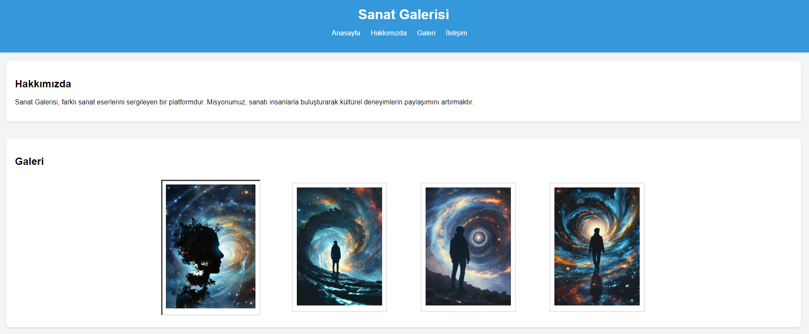
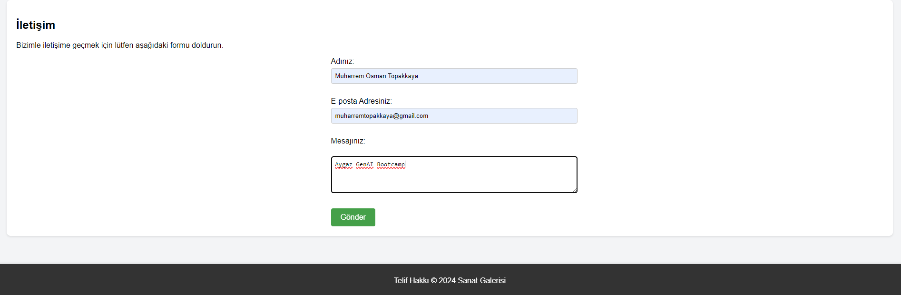
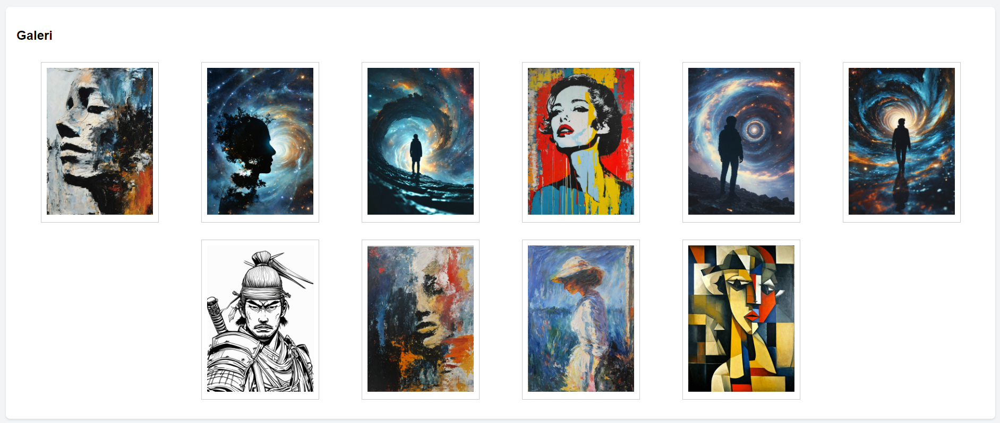
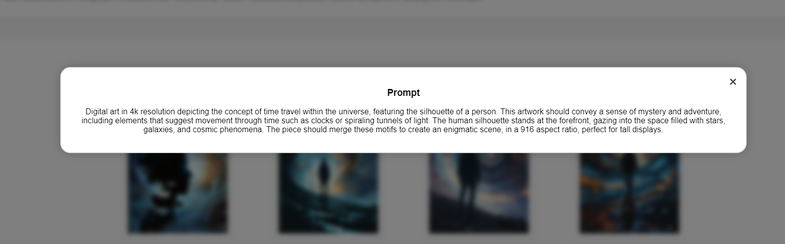
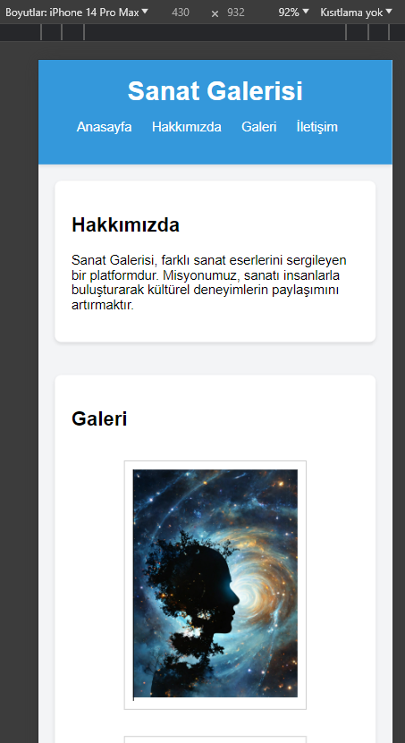
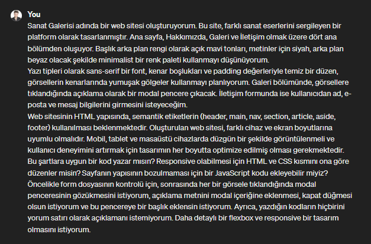
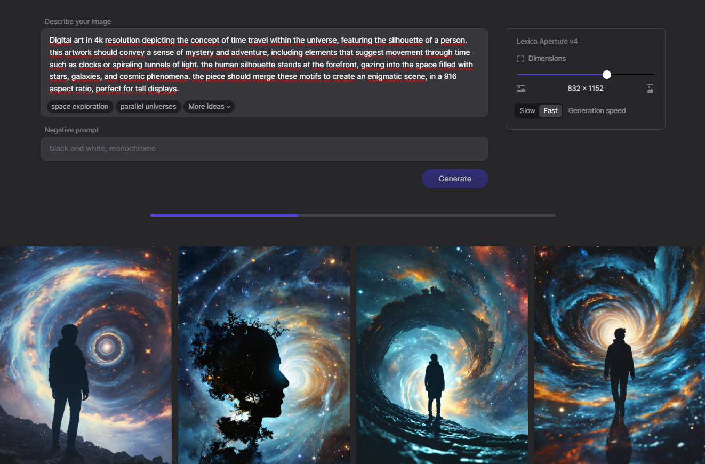
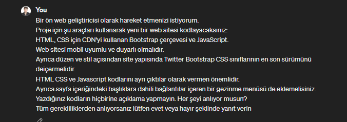

# Sanat Galerisi Web Sitesi
Bu proje, farklı sanat eserlerini sergileyen bir platform olan Sanat Galerisi web sitesini oluşturmayı amaçlar. Ana sayfa, Hakkımızda, Galeri ve İletişim olmak üzere dört ana bölümden oluşur.

## Renkler ve Tasarım
Başlık arka plan rengi olarak açık mavi tonları, metinler için siyah, arka plan beyaz olacak şekilde minimalist bir renk paleti kullanılmıştır. Yazı tipleri olarak sans-serif bir font tercih edilmiş ve kenar boşluklarıyla temiz bir düzen sağlanmıştır. Görsellerin kenarlarında yumuşak gölgeler kullanılarak estetik bir görünüm elde edilmiştir.

## Özellikler
- Web sitesi HTML yapısında semantik etiketler kullanılarak oluşturulmuştur.
- Responsive tasarım ile farklı cihaz ve ekran boyutlarına uyum sağlanmıştır.
- Her bir görsele tıklandığında açıklama olarak bir modal pencere çıkmaktadır.
- İletişim formu kullanıcıdan ad, e-posta ve mesaj bilgilerini girmesini sağlar.

## Kullanılan Teknolojiler
- HTML5
- CSS3 (Flexbox kullanılarak detaylı ve responsive tasarım)
- JavaScript (Modal pencere açma/kapatma işlevselliği)

## Kullanılan Yapay Zeka Teknolojileri

Bu projede, sanat galerisi web sitesinin oluşturulmasında yapay zeka teknolojilerinden faydalanılmıştır. Özellikle, Stable Diffusion (Lexica.Art) ve ChatGPT gibi yapay zeka modelleri kullanılarak proje geliştirilmiştir. Bu modeller, projenin tamamında içerik üretimi ve arayüz tasarımında yardımcı olmuştur.

## Kurulum
Projeyi klonlayın:
 ```bash

git clone https://github.com/muharremosmantopakkaya/PortfolioApp.git
 ```
Proje dizinine gidin:

 ```bash

cd PortfolioApp
 ```
Dosyaları bir web sunucusuna yükleyin veya yerel bir sunucuda çalıştırın.

## Kullanım
Ana sayfada gezinin ve sanat eserlerini keşfedin.
Galeri bölümünde her bir sanat eserinin açıklamasını görüntüleyin.
İletişim formunu kullanarak bizimle iletişime geçin.

## Uygulama Arayüzleri

<div style="display:flex; flex-wrap: wrap; justify-content: space-between;">
    
    
       
</div>

<div style="display:flex; justify-content: space-between; margin-top: 50px;">
    

</div>

<div style="display:flex; justify-content: space-between; margin-top: 30px;">
    
</div>


## Kullandığım promptlar 
<div style="display:flex; justify-content: space-between;">

  
  
  
</div>


